# tokenprice

[](https://pypi.org/project/tokenprice/)

API pricing estimates for 1k+ LLMs from [tokentracking](https://github.com/DiTo97/tokentracking) with multi-currency support.

```mermaid
flowchart LR
    subgraph Your Application
        A[🤖 LLM API Call]
        B[📊 Usage Data]
    end

    subgraph tokenprice
        C[get_pricing / compute_cost]
        D[(Cache<br/>6h TTL)]
    end

    subgraph Data Sources
        E[tokentracking<br/>prices.json]
        F[JSDelivr<br/>Currency API]
    end

    A --> B
    B --> C
    C <--> D
    D -.->|miss| E
    D -.->|FX miss| F
    C --> G[💰 Cost in USD/EUR/...]

    style A fill:#e1f5fe
    style G fill:#c8e6c9
    style C fill:#fff3e0
    style D fill:#fce4ec
```



## Why tokenprice?

Token pricing for LLMs changes frequently across different providers. This library provides up-to-date pricing information by leveraging [tokentracking](https://github.com/DiTo97/tokentracking) (a fork of [LLMTracker](https://github.com/MrUnreal/LLMTracker) with cache pricing support), which updates pricing data every six hours from various sources.

**Important:** This library does **not** estimate token counts from strings or messages. Any estimation would be too approximate for anything beyond plain text, and the [tokencost](https://github.com/AgentOps-AI/tokencost) package already handles that use case well. tokenprice focuses solely on providing accurate, current pricing data.

## Features

- Up-to-date LLM pricing from [tokentracking](https://github.com/DiTo97/tokentracking)
- Async caching via async-lru with a 6-hour TTL for pricing data
- Multi-currency conversion via JSDelivr currency API with a 24-hour cached USD rates map
- Clean, typed data models (Pydantic)

## Installation

```bash
uv add tokenprice
```

Or with pip:

```bash
pip install tokenprice
```

## Usage

The public API exposes both async and sync functions:

**Async API:**
- `get_pricing(model_id, currency="USD")`
- `compute_cost(model_id, input_tokens, output_tokens, currency="USD")`

**Sync API:**
- `get_pricing_sync(model_id, currency="USD")`
- `compute_cost_sync(model_id, input_tokens, output_tokens, currency="USD")`

### Async Example

```python
import asyncio

from tokenprice import get_pricing, compute_cost


async def main():
    model_id = "openai/gpt-5.2"

    # Get pricing (cached transparently for ~6 hours)
    pricing = await get_pricing(model_id, currency="EUR")
    print(f"Pricing for {model_id} ({pricing.currency}):")
    print(f"  Input per 1M tokens: €{pricing.input_per_million:.2f}")
    print(f"  Output per 1M tokens: €{pricing.output_per_million:.2f}")

    # Compute total cost for a usage
    total = await compute_cost(model_id, input_tokens=1000, output_tokens=500, currency="EUR")
    print(f"Total cost (EUR): €{total:.6f}")


asyncio.run(main())
```

### Sync Example

For simpler scripts, Jupyter notebooks, or environments where async is inconvenient, use the sync versions:

```python
from tokenprice import get_pricing_sync, compute_cost_sync

model_id = "openai/gpt-5.2"

# Get pricing (cached transparently for ~6 hours)
pricing = get_pricing_sync(model_id, currency="EUR")
print(f"Pricing for {model_id} ({pricing.currency}):")
print(f"  Input per 1M tokens: €{pricing.input_per_million:.2f}")
print(f"  Output per 1M tokens: €{pricing.output_per_million:.2f}")

# Compute total cost for a usage
total = compute_cost_sync(model_id, input_tokens=1000, output_tokens=500, currency="EUR")
print(f"Total cost (EUR): €{total:.6f}")
```

Both sync and async APIs share the same underlying cache, so mixing them won't cause duplicate fetches.

### Helpful Error Messages

When you make a typo in a model ID or currency code, tokenprice provides helpful "Did you mean?" suggestions:

```python
from tokenprice import get_pricing_sync

# Typo in model name: "gpt4" instead of "gpt-4"
get_pricing_sync("openai/gpt4")
# ValueError: Model not found: openai/gpt4. Did you mean 'openai/gpt-4'?

# Typo in currency: "ERU" instead of "EUR"
get_pricing_sync("openai/gpt-4", currency="ERU")
# ValueError: Unsupported currency: ERU. Did you mean 'EUR'?
```

## Data Source

Pricing data is sourced from [tokentracking](https://github.com/DiTo97/tokentracking), a fork of [LLMTracker](https://github.com/MrUnreal/LLMTracker) with cache pricing support. The data is updated every six hours from various LLM providers. The raw data is available at:
```
https://raw.githubusercontent.com/DiTo97/tokentracking/main/data/current/prices.json
```

Caching uses async-lru with a 6-hour TTL aligned to tokentracking's refresh cadence. Caching is fully transparent to callers of the public API.

Note: Pricing data from tokentracking is denominated in USD; currency conversion uses daily USD base rates from the JSDelivr currency API with a 24h cache (keys uppercased).

## Development

This project uses `uv` as the package manager.

### Setup

```bash
uv sync
```

### Running Tests

```bash
uv run pytest
```

### Quality (pre-commit)

Use pre-commit to run formatting and linting consistently:

```bash
# One-time setup
uv run pre-commit install

# Run all hooks on the codebase
uv run pre-commit run -a
```

This runs `ruff-format` and `ruff` with `--fix`, along with basic repo hygiene checks.

### CI

Pre-commit hooks run in CI via GitHub Actions using `uv` (see [.github/workflows/pre-commit.yml](.github/workflows/pre-commit.yml)). Pushes and pull requests to `main`/`master` execute the same checks as local runs.

## API Surface

The public API includes both async and sync versions:
- Async: `get_pricing`, `compute_cost`
- Sync: `get_pricing_sync`, `compute_cost_sync`

Internal modules and models are not considered public and may change. Both APIs share the same cache, so you can mix async and sync calls without performance penalty.

## Credits

- Pricing data: [tokentracking](https://github.com/DiTo97/tokentracking) (fork with cache pricing support)
- Upstream: [LLMTracker](https://github.com/MrUnreal/LLMTracker) by MrUnreal

## CLI

Install via UV or pip, then use the `tokenprice` command.

```bash
# Show price per 1M tokens (USD default)
tokenprice pricing openai/gpt-5.2

# Convert to another currency (uses cached FX rates)
tokenprice pricing openai/gpt-5.2 --currency EUR

# JSON output for scripting
tokenprice pricing openai/gpt-5.2 --json

# Compute total cost for a usage
tokenprice cost openai/gpt-5.2 --in 1000 --out 500 --currency EUR
```

## License

See [LICENSE](LICENSE) file for details.
