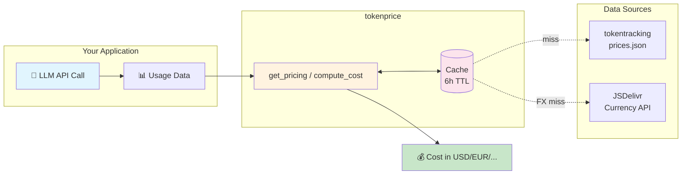

```mermaid
flowchart LR
    subgraph Your Application
        A[🤖 LLM API Call]
        B[📊 Usage Data]
    end

    subgraph tokenprice
        C[get_pricing / compute_cost]
        D[(Cache<br/>6h TTL)]
    end

    subgraph Data Sources
        E[tokentracking<br/>prices.json]
        F[JSDelivr<br/>Currency API]
    end

    A --> B
    B --> C
    C <--> D
    D -.->|miss| E
    D -.->|FX miss| F
    C --> G[💰 Cost in USD/EUR/...]

    style A fill:#e1f5fe
    style G fill:#c8e6c9
    style C fill:#fff3e0
    style D fill:#fce4ec
```
